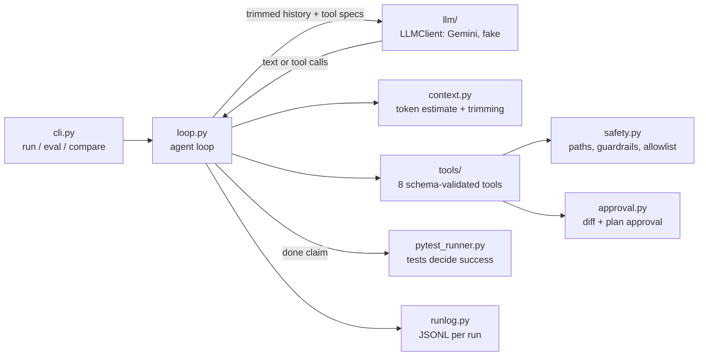

# AgentLoop

A command-line coding agent written from scratch in Python. It takes a plain-English task and a repo, then reads, edits and tests code in a loop until the tests pass or it stops safely. There is no LangChain or other agent framework: the loop, tools, safety layer, context management and evaluation are all built by hand.

> Demo GIF: record one with `asciinema rec` (or ScreenToGif on Windows) while running the auth.py example below, and put it here.

## Install and run

```bash
pip install -e ".[dev]"
export GEMINI_API_KEY=...            # Windows cmd: set GEMINI_API_KEY=...   PowerShell: $env:GEMINI_API_KEY="..."
agentloop run "fix the failing test in auth.py" --repo examples/buggy_repo
```

Get a free key at https://aistudio.google.com/apikey. If `agentloop` isn't on your PATH, use `python -m agentloop.cli` instead. When it finishes, `git checkout -- examples/` resets the example.

## What a run looks like

1. **Safety check.** AgentLoop refuses to start if the repo has uncommitted changes, so every run can be undone with `git checkout -- .`.
2. **Explore.** The model calls `list_files`, `run_tests`, `search_code` and `read_file`.
3. **Plan.** It must submit a numbered plan with `submit_plan`. You approve it, edit it or stop the run. File edits are blocked until a plan is approved.
4. **Edit.** Each change is shown as a coloured diff for you to approve: yes, no (with feedback to the agent), or all for the session.
5. **Verify.** When the model says it is done, AgentLoop runs the tests itself. If they fail, the model is told so and keeps working. "Done" means the suite passes, not that the model said so.

## Architecture



Each component is one module with its own unit tests. The loop only talks to the `LLMClient` interface, so adding a provider (Groq, Ollama) is one new class.

| Tool | What it does |
| --- | --- |
| `list_files` | Repo layout with line counts (skips .git, caches, venvs) |
| `read_file` | File with line numbers, optional line range, capped at 200 lines |
| `search_code` | Regex search, returns `path:line: text` |
| `submit_plan` | Numbered plan for approval (plan mode) |
| `edit_file` | Replace one exact, unique snippet |
| `create_file` | New files only |
| `run_tests` | pytest with a timeout; pass/fail counts plus the first failures |
| `git_diff` | Everything changed so far, including new files |

## Safety and guardrails

All of these are enforced in code, not by asking the model nicely:

- **Sandboxed paths.** Every path must resolve inside the repo. `..`, absolute paths, symlinks pointing outside, and `.git/` are rejected.
- **Command allowlist.** The agent cannot run arbitrary commands. Only `python -m pytest`, `git diff`, `git status` and `git ls-files` can run, each with a timeout so an infinite loop in a test can't hang the run.
- **Human approval** for every file write (coloured diff) and for the plan. `--yes` turns approvals off.
- **No cheating.** Edits to test files, `conftest.py` and pytest config files (`pytest.ini`, `tox.ini`, `setup.cfg`, `pyproject.toml`) are rejected unless the task allows it. So is adding skip or xfail markers or `sys.exit` calls to code.
- **Budgets.** Max steps, max tokens and max wall-clock time. When one is hit, the run stops with a summary.
- **Loop detection.** The run stops if the same call with the same arguments happens 3 times with no file change in between, or after 6 failed tool calls in a row.

## Context management

Before every model call, AgentLoop estimates the prompt size (about 4 characters per token). Once it passes 75% of `--context-limit`, the oldest tool results are replaced with stubs such as `[read_file auth.py: 140 lines, omitted to save context; call the tool again if you need it]`. The 4 most recent results always stay in full. The system prompt is versioned in `prompts/`.

## Evaluation

`agentloop eval` runs a 20-task benchmark (8 easy, 8 medium, 4 hard; see [evals/README.md](evals/README.md)). Each task is copied into a temp folder and committed to git, then the agent runs with fixed budgets and auto-approval. After that, AgentLoop adds **hidden tests** and runs the whole suite itself to judge success. This means special-casing the visible tests fails.

```bash
agentloop eval --version v1 --model gemini-flash-lite-latest --min-interval 5
agentloop eval --version v2 --model gemini-flash-lite-latest --min-interval 5 --prompt prompts/system_v2.md
agentloop compare evals/results/v1.csv evals/results/v2.csv
```

The experiment: **v1** uses the short baseline prompt (`system_v1.md`). **v2** changes one thing, the prompt (`system_v2.md`), which adds a step-by-step workflow, rules about tests (test edits are blocked, and hidden tests check the fix) and concrete tool-call examples. `--no-plan` gives a second experiment: plan mode on vs off.

### Results

One run of each version over all 20 tasks with `gemini-flash-lite-latest` on the free tier (7 October 2026), using the commands above. Raw results: [v1.csv](evals/results/v1.csv) and [v2.csv](evals/results/v2.csv).

| Metric | v1 | v2 |
| --- | --- | --- |
| Pass rate (%) | 95.0 | 100.0 |
| Easy / medium / hard pass rate (%) | 100 / 87.5 / 100 | 100 / 100 / 100 |
| Avg steps per task | 9.5 | 10.1 |
| Avg tokens per task | 21,877 | 26,892 |
| Invalid tool calls | 0 | 0 |
| Cheating attempts blocked | 1 | 0 |
| Loops detected | 1 | 0 |

- **v2 solved the one task v1 failed.** On m05 (`parse_duration`), v1 made every part of the regex optional, passed the visible tests and stopped, but an empty string still parsed as 0 seconds instead of raising an error. The hidden tests caught it. v2 made the same first edit, then searched for the docstring's rule "at least one must be present" and added the missing check.
- **v2 had no blocked test edits and no loops.** Its prompt says test edits are blocked; v1's prompt doesn't. v1's blocked edit (m03) was an attempt to add assertions to a test file. It then re-ran the tests until loop detection stopped it, but its code fix was already correct, so the task passed. Details are in [v1_failures.md](evals/results/v1_failures.md).
- **v2 costs about 23% more tokens.** 14 of the 20 tasks took the same number of steps under both prompts, and on those v2 used about 330 more input tokens per call, because its longer system prompt is sent with every call. The rest comes from extra checking steps on h01, h04, m05 and m06.
- **Caveats.** This is one run per task, so a one-task difference could be chance; `--repeat 3` would show whether it holds, if your daily quota allows. Time per task (81 s for v1, 61 s for v2) is left out because it mostly reflects how busy Gemini was: v1 hit a slow patch on e02 to e04. One v1 run (m04) ended on a Gemini 503 error after the fix was already written, and still passed.

Failure logs are written to `evals/results/<version>_failures.md`.

## Design decisions

- **Why snippet edits?** Rewriting whole files lets a model silently drop code it didn't read. Replacing one exact, unique snippet keeps changes small and reviewable. A wrong snippet fails loudly with a hint ("snippet not found; you included read_file's line numbers").
- **Why no framework?** The point is to own the hard parts: tool schemas, error messages the model can recover from, context trimming, and deciding when a run is really done.
- **Why tests decide success?** Models often claim "fixed" when they aren't. AgentLoop runs pytest itself after the last edit, and evals add hidden tests the agent never sees.
- **Errors are data.** Bad arguments, unknown tools and blocked actions come back to the model as clear `Error: ...` tool results instead of crashing. They are also counted, since invalid calls measure tool design quality.
- **Structural guardrails over prompt rules.** "Don't edit the tests" in a prompt is a suggestion. A write gate that rejects the edit is a rule.

## Development

```bash
pytest                       # 120+ unit tests, no network or API key needed
```

The tests use `FakeLLMClient`, which returns scripted responses. `tests/test_benchmark.py` validates every benchmark task against its reference solution.

```
agentloop/
  cli.py            typer commands: run, eval, compare
  loop.py           the agent loop, budgets, verification, loop detection
  session.py        wires workspace, safety, tools and loop together
  llm/              LLMClient interface, Gemini provider, fake, throttle
  tools/            Tool base class + one module per tool family
  safety.py         paths, guardrails, command allowlist, git checks
  approval.py       console and auto approvers
  context.py        token estimates and trimming
  pytest_runner.py  runs and summarises pytest
  evals.py          benchmark harness, CSV results, failure log
prompts/            system_v1.md, system_v2.md
evals/tasks/        20 benchmark repos
evals/results/      CSV + failure log per version
examples/           demo_repo (questions), buggy_repo (a real fix)
tests/              unit tests
```
